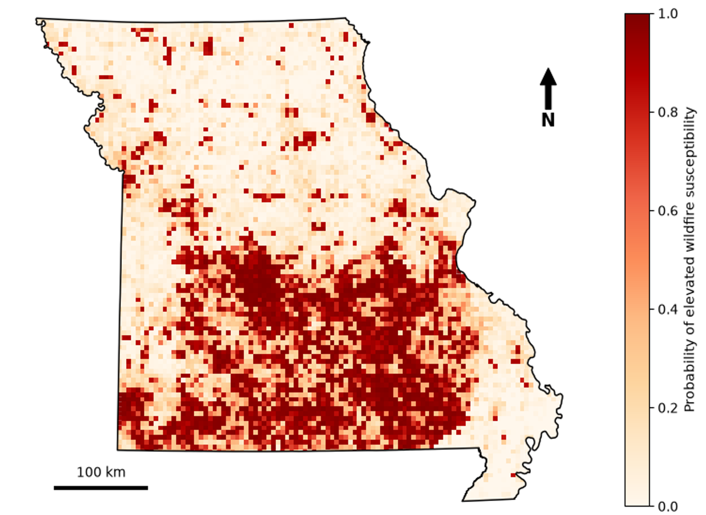
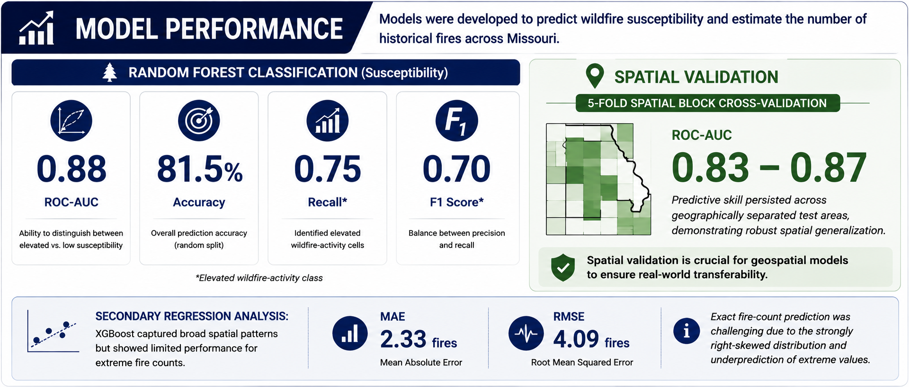
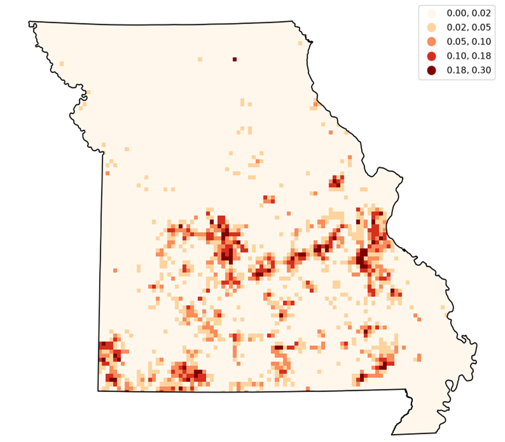

# Missouri Wildfire Susceptibility Prediction Using Geospatial Machine Learning

A GeoAI framework for statewide wildfire susceptibility prediction and community risk assessment in Missouri using geospatial machine learning, spatial validation, and environmental and socioeconomic data.

## Overview

This project develops a geospatial machine-learning framework for identifying areas of elevated wildfire susceptibility across Missouri. Historical wildfire occurrences are integrated with land cover, climate, terrain, population, transportation, wildland–urban interface (WUI), and social vulnerability data on a statewide 5 km × 5 km grid.

The primary analysis uses a Random Forest classifier to estimate wildfire susceptibility and spatial block cross-validation to evaluate geographic generalizability. A secondary XGBoost regression model explores prediction of historical wildfire counts. Model-derived susceptibility is further combined with WUI exposure and social vulnerability to construct a Community Wildfire Risk Index.

## Wildfire Susceptibility

The Random Forest model identifies geographic variation in wildfire
susceptibility across Missouri using environmental, climatic, infrastructure,
and population-related predictors.

<p align="center">
  
</p>

<p align="center">
  <em>Random Forest wildfire susceptibility across Missouri's 5 km × 5 km analysis grid.</em>
</p>

## Study Area

The study covers the state of Missouri using a 5 km × 5 km analysis grid. Historical wildfire occurrences from 1992–2020 were aggregated to grid cells and integrated with environmental, climatic, infrastructure, and population-related predictors.

## Methods

The primary workflow includes:

* Geospatial preprocessing and aggregation to a common 5 km grid
* Land-cover feature engineering
* Climate, terrain, population, and transportation feature integration
* Binary wildfire-susceptibility classification
* Random Forest modeling
* 80/20 stratified train-test evaluation
* 50 km spatial block cross-validation
* Feature-importance analysis
* XGBoost regression for exploratory wildfire-count prediction
* Community Wildfire Risk Index development

For the primary classification model, grid cells with **0–3 historical fires** are classified as lower activity and cells with **4 or more historical fires** as elevated activity.

## Primary Model Performance

The Random Forest susceptibility model achieved approximately:

* **Accuracy:** 0.815
* **ROC-AUC:** 0.880

Five-fold 50 km spatial block cross-validation produced ROC-AUC values of approximately **0.83–0.87**, providing a more geographically conservative evaluation of model performance.

<p align="center">
  
</p>

The results indicate that the framework is more suitable for identifying areas of relative elevated wildfire susceptibility than for predicting exact wildfire counts.

## Community Wildfire Risk

Wildfire susceptibility alone does not capture potential community impacts. The project therefore combines model-derived susceptibility with WUI exposure and population-weighted social vulnerability to construct a Community Wildfire Risk Index.

<p align="center">
  
</p>

This provides a framework for identifying locations where elevated wildfire susceptibility overlaps with human exposure and social vulnerability.

## Repository Structure

```text
missouri-wildfire-geoai/
├── README.md
├── .gitignore
├── notebooks/
│   ├── 01_primary_wildfire_model.ipynb
│   └── 02_exploratory_feature_analysis.ipynb
├── data/
│   └── README.md
├── figures/
├── results/
├── docs/
└── poster/
```

### Notebooks

**`01_primary_wildfire_model.ipynb`**
Primary analysis including data integration, Random Forest wildfire-susceptibility modeling, random train-test evaluation, spatial block cross-validation, XGBoost regression, mapping, and community risk analysis.

**`02_exploratory_feature_analysis.ipynb`**
Extended exploratory analysis incorporating additional predictors such as fuel characteristics, soils, wind, drought, and infrastructure-related variables.

## Data

The project integrates data from multiple public geospatial sources, including:

* Fire Program Analysis Fire-Occurrence Database (FPA-FOD)
* National Land Cover Database (NLCD)
* PRISM Climate Group
* Missouri Spatial Data Information Service (MSDIS)
* SILVIS Lab population and WUI datasets
* Missouri Department of Transportation (MoDOT)
* CDC/ATSDR Social Vulnerability Index
* LANDFIRE
* gSSURGO
* TerraClimate

Large raw and processed geospatial datasets are not stored in this repository. See [`data/README.md`](data/README.md) for additional information on data sources and preparation.

## Tools and Technologies

* Python
* GeoPandas
* pandas
* NumPy
* scikit-learn
* XGBoost
* Pyogrio
* Matplotlib
* Seaborn
* SHAP
* ArcGIS Pro
* Geospatial machine learning
* Spatial cross-validation

## Contributors

**Isabella Garza**
Research Intern
UMSL Geospatial Collaborative

**Mehdi Javid**
Project Supervisor
UMSL Geospatial Collaborative

## Acknowledgment

This work was conducted through the UMSL Geospatial Collaborative as part of a Summer 2026 GeoAI research project.

## Citation

If you use or build upon this project, please cite:

Garza, I. & Javid, M., & Amer, R. (2026). *Missouri Wildfire Susceptibility Prediction
Using Geospatial Machine Learning*. UMSL Geospatial Collaborative.
GitHub repository.

## License

This project is released under the MIT License. See `LICENSE` for details.
